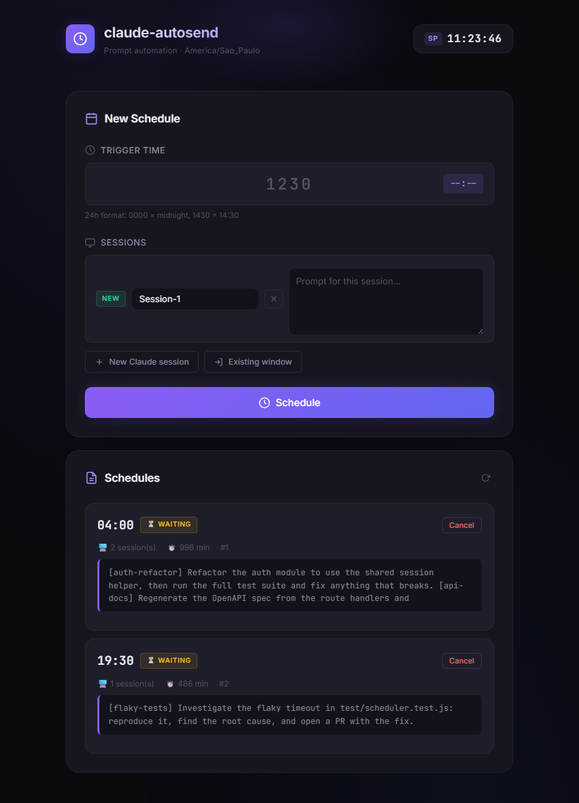

# claude-autosend

[](https://github.com/Rafaelrr5/claude-autosend/actions/workflows/ci.yml) [](LICENSE) [](package.json) [](#requirements)

Schedule prompts to fire into [Claude Code](https://claude.com/claude-code) CLI sessions at a chosen wall-clock time.



Built for one specific annoyance: you hit a usage limit at 22:00, it resets at 04:00, and you would rather not set an alarm. Queue the prompts, go to sleep, read the results in the morning.

> **Windows only.** It drives PowerShell to spawn terminals and to focus existing windows. There is no macOS or Linux path.

---

## What it does

Two ways to deliver a prompt when the timer fires:

| Mode | Behaviour |
|---|---|
| **New session** | Opens a fresh PowerShell window, `cd`s into your working directory, and launches `claude` with the prompt as a single argument. |
| **Existing window** | Picks a running window by PID, copies the prompt to the clipboard, focuses the window, and sends `Ctrl+V` + `Enter`. |

A schedule can mix both, so one trigger can fan out across several sessions.

## Requirements

- Windows 10/11 with PowerShell
- Node.js 18+
- [Claude Code CLI](https://claude.com/claude-code) on your `PATH` (`claude --version` should work)

## Install

```bash
git clone https://github.com/Rafaelrr5/claude-autosend.git
cd claude-autosend
npm install
cp .env.example .env   # then edit it
npm start
```

Open <http://127.0.0.1:3847>.

## Configuration

All settings are environment variables — see [`.env.example`](.env.example).

| Variable | Default | Purpose |
|---|---|---|
| `PORT` | `3847` | Port for the web UI |
| `HOST` | `127.0.0.1` | Bind address. **Leave it on loopback.** |
| `CLAUDE_WORKDIR` | current directory | Directory Claude Code is launched in |
| `CLAUDE_FLAGS` | *(empty)* | Extra flags for the `claude` CLI |
| `TZ_NAME` | `America/Sao_Paulo` | IANA timezone for the scheduled time |
| `DATA_FILE` | `schedules.json` | JSON file pending schedules are written to |

### Unattended runs

By default no extra flags are passed, so Claude Code will stop and ask for approval — which defeats the purpose if you are asleep. To let scheduled prompts run unattended:

```
CLAUDE_FLAGS=--dangerously-skip-permissions
```

Read [SECURITY.md](SECURITY.md) before you do. This is deliberately opt-in.

## Usage

1. Enter the target time as four digits, `HHMM` (e.g. `0400`).
2. Add one or more sessions — **New Claude session** for a fresh terminal, **Existing window** to pick a live one.
3. Write a prompt for each session. Optionally select files under **Attachments**; select again to add more, or **Remove** individual files.
4. Press **Schedule**. It shows up below with a live countdown and a cancel button.

If the time has already passed today, it is scheduled for tomorrow.

## API

The UI is a thin client over a small JSON API.

| Method | Endpoint | Purpose |
|---|---|---|
| `POST` | `/api/schedule` | Create a schedule — `{ time: "0400", sessions: [...] }` |
| `GET` | `/api/schedules` | List schedules and their results |
| `DELETE` | `/api/schedule/:id` | Cancel a pending schedule |
| `GET` | `/api/windows` | List visible windows with PIDs |
| `GET` | `/api/time` | Current time in the configured timezone |

Session object: `{ type: "new" | "existing", prompt: string, label?: string, pid?: number }`

Optional session field: `attachments: [{ name: "notes.txt", data: "aGVsbG8=" }]`.
`data` is canonical base64 of the file bytes, without a data-URL prefix. Client paths
are never used for storage. The list endpoint returns `attachmentCount` and
`attachments: [{ name, size }]` metadata, not file contents.

### Attachments

- Up to **10 files per session**, **5 MiB per file**, **20 MiB per schedule**. The JSON request limit is 32 MiB to allow base64 overhead.
- Files are copied at scheduling time into generated subdirectories of `DATA_FILE + ".attachments"` (default: `schedules.json.attachments/`), outside the public web directory. Changes to the originals do not alter scheduled copies; pending copies survive a server restart.
- Both delivery modes append absolute paths and a request to read the attached files. Binary bytes are not pasted as text. New sessions receive the attachment directory through `--add-dir`; existing sessions may ask permission to read files outside their workspace. Normal Claude Code permissions remain in effect. Whether a format can be interpreted depends on Claude Code and the tools available to it.
- Failed scheduling keeps your selections. Successful scheduling clears them. Missing/unreadable copies block dispatch and appear as delivery errors.
- Cancelling a waiting schedule removes its copies. Files from delivered, failed, or missed schedules remain available because Claude can read them asynchronously. **There is no automatic retention limit:** remove the corresponding generated directory manually only after the relevant sessions are finished. Never remove copies belonging to waiting schedules.
- The default attachment directory is gitignored. If using a custom `DATA_FILE`, keep both that file and its attachment directory outside version control and outside `public/`.

### Verification

`npm test` covers the HTTP API, exact uploaded bytes, persistence/restart, both
delivery branches (Windows calls stubbed), validation, cleanup and frontend
selection/submission behavior. `npm run check` checks JavaScript syntax. Tests
use temporary storage and do not launch Claude sessions.

## Known limitations

- **A job whose time passed while the server was down never fires.** Pending schedules survive a restart (they are written to `DATA_FILE` and re-armed on boot), but anything already overdue is marked `missed` rather than fired late.
- **The machine must stay awake.** Sleep or hibernation stops the timer.
- **`SendKeys` needs the desktop.** Existing-window delivery steals focus and fails on a locked workstation.

## Contributing

Issues and pull requests welcome. See [CONTRIBUTING.md](CONTRIBUTING.md).

## License

[MIT](LICENSE)
