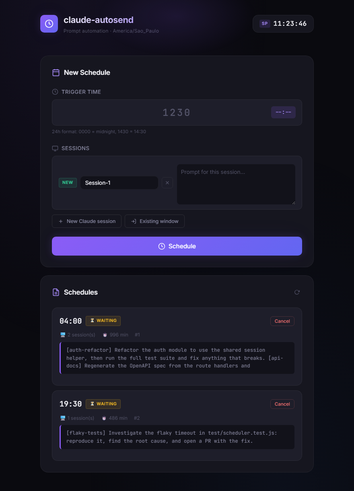

# claude-autosend

[](https://github.com/Rafaelrr5/claude-autosend/actions/workflows/ci.yml) [](LICENSE) [](package.json) [](#requirements)

Schedule prompts to fire into [Claude Code](https://claude.com/claude-code) CLI sessions at a chosen wall-clock time.



Built for one specific annoyance: you hit a usage limit at 22:00, it resets at 04:00, and you would rather not set an alarm. Queue the prompts, go to sleep, read the results in the morning.

> **Windows only.** It drives PowerShell to spawn terminals and to focus existing windows. There is no macOS or Linux path.

---

## What it does

Two ways to deliver a prompt when the timer fires:

| Mode | Behaviour |
|---|---|
| **New session** | Opens a fresh PowerShell window, `cd`s into your working directory, and launches `claude` with the prompt as a single argument. |
| **Existing window** | Picks a running window by PID, copies the prompt to the clipboard, focuses the window, and sends `Ctrl+V` + `Enter`. |

A schedule can mix both, so one trigger can fan out across several sessions. Existing windows are served first (a new session's window would steal focus), and schedules that fire at the same moment are delivered one after another, never interleaved.

## Requirements

- Windows 10/11 with PowerShell
- Node.js 18+
- [Claude Code CLI](https://claude.com/claude-code) on your `PATH` (`claude --version` should work)

## Windows portable (no Node.js needed)

Download [Claude-Autosend-Windows-x64.zip](https://github.com/Rafaelrr5/claude-autosend/releases/download/v0.1.0-windows-preview/Claude-Autosend-Windows-x64.zip) (unsigned preview), extract it, and double-click
**Abrir-Claude-Autosend**. The folder carries its own Node.js runtime and
dependencies, so no terminal, Node.js or npm install is needed.

[Claude Code](https://code.claude.com/docs/en/setup) itself is **not** bundled:
install it and sign in once before scheduling anything. Normal Claude Code
permission prompts stay on.

- Schedules, attachment copies and logs live in
  `%LOCALAPPDATA%\3R Studios\Claude Autosend`, never in the extracted folder.
- New sessions start in your user folder. To use a project folder, put its path
  in `pasta-do-projeto.txt` in that data folder and reopen the app.
- The server binds `127.0.0.1:3847` only. If another program holds the port, the
  launcher says so instead of opening that program's page. Double-clicking again
  while it runs just reopens the dashboard; **Encerrar Claude Autosend** in the
  dashboard stops it (local, token-protected).
- If VBScript is disabled on your Windows, run `app\abrir-com-janela.cmd`
  instead (it keeps a console window open).

Build it yourself on Windows x64 with `npm run build:windows` (needs Python 3
for the ZIP step). It copies the running `node.exe`, runs
`npm ci --omit=dev --ignore-scripts`, writes third-party notices and produces
`dist/Claude-Autosend-Windows-x64.zip` plus a file list with SHA-256 hashes.

<!-- guia-ptbr:inicio -->
### Guia rápido (português)

**O que é:** o Claude Autosend agenda textos (prompts) para o Claude Code que
está instalado **neste computador**. Ele não é um chat online e não funciona
sozinho: no horário marcado, entrega o seu texto ao Claude Code daqui.

**Antes de usar**

1. Instale o Claude Code e entre na sua conta nele uma vez:
   https://code.claude.com/docs/en/setup
2. Extraia (descompacte) o ZIP inteiro numa pasta, por exemplo em Documentos.
3. Clique duas vezes em **Abrir-Claude-Autosend**. Se o Windows perguntar se
   deseja abrir o arquivo, escolha **Abrir**. O painel abre no navegador.

**Como usar**

1. Digite o horário com 4 números (ex.: `0400` para 4h da manhã).
2. Escolha como enviar:
   - **New Claude session**: abre uma janela nova do Claude na pasta do projeto.
   - **Existing window**: cola o texto numa janela do Claude que já está aberta.
     O computador precisa estar desbloqueado e ninguém deve usar o teclado
     nesse momento.
3. Escreva o texto e clique em **Schedule**.

**Importante**

- Deixe o computador **ligado e acordado** (sem suspender nem hibernar) até o
  horário. Horários que passam com o programa fechado não são enviados depois.
- Fechar o navegador **não** desliga o programa. Para desligar, use o botão
  **Encerrar Claude Autosend** no painel. Para abrir de novo, clique duas vezes
  em **Abrir-Claude-Autosend**.
- O Claude pode **pausar e pedir sua permissão** antes de agir. Isso é normal e
  protege seus arquivos; se você não estiver por perto, a tarefa espera. Este
  programa não desliga essas proteções.
- Pasta do projeto: as sessões novas abrem na sua pasta de usuário. Para usar
  outra pasta, edite o arquivo `pasta-do-projeto.txt` (o painel mostra onde ele
  fica), salve, encerre e abra o programa de novo.
- Seus agendamentos, anexos e registros ficam em
  `%LOCALAPPDATA%\3R Studios\Claude Autosend`. Para remover tudo, apague a
  pasta do programa e essa pasta.
- Se aparecer um aviso de que a porta 3847 está em uso, feche o outro programa
  que usa essa porta ou reinicie o computador.
- Se o Abrir-Claude-Autosend não funcionar no seu Windows, use
  `app\abrir-com-janela.cmd` e deixe a janela aberta.
<!-- guia-ptbr:fim -->

## Install

```bash
git clone https://github.com/Rafaelrr5/claude-autosend.git
cd claude-autosend
npm install
cp .env.example .env   # then edit it
npm start
```

Open <http://127.0.0.1:3847>.

## Configuration

All settings are environment variables — see [`.env.example`](.env.example).

| Variable | Default | Purpose |
|---|---|---|
| `PORT` | `3847` | Port for the web UI |
| `HOST` | `127.0.0.1` | Bind address. **Leave it on loopback.** |
| `CLAUDE_WORKDIR` | current directory | Directory Claude Code is launched in |
| `CLAUDE_FLAGS` | *(empty)* | Extra flags for the `claude` CLI |
| `CLAUDE_BIN` | found on `PATH` | Full path to `claude.exe`, if it is not found automatically |
| `TZ_NAME` | `America/Sao_Paulo` | IANA timezone for the scheduled time |
| `DATA_FILE` | `schedules.json` | JSON file pending schedules are written to |

### Unattended runs

By default no extra flags are passed, so Claude Code will stop and ask for approval — which defeats the purpose if you are asleep. To let scheduled prompts run unattended:

```
CLAUDE_FLAGS=--dangerously-skip-permissions
```

Read [SECURITY.md](SECURITY.md) before you do. This is deliberately opt-in.

## Usage

1. Enter the target time as four digits, `HHMM` (e.g. `0400`).
2. Add one or more sessions — **New Claude session** for a fresh terminal, **Existing window** to pick a live one.
3. Write a prompt for each session. Optionally select files under **Attachments**; select again to add more, or **Remove** individual files.
4. Press **Schedule**. It shows up below with a live countdown and a cancel button.

If the time has already passed today, it is scheduled for tomorrow.

## API

The UI is a thin client over a small JSON API.

| Method | Endpoint | Purpose |
|---|---|---|
| `POST` | `/api/schedule` | Create a schedule — `{ time: "0400", sessions: [...] }` |
| `GET` | `/api/schedules` | List schedules and their results |
| `DELETE` | `/api/schedule/:id` | Cancel a pending schedule |
| `GET` | `/api/windows` | List visible windows with PIDs |
| `GET` | `/api/time` | Current time in the configured timezone |

Session object: `{ type: "new" | "existing", prompt: string, label?: string, pid?: number }`

Optional session field: `attachments: [{ name: "notes.txt", data: "aGVsbG8=" }]`.
`data` is canonical base64 of the file bytes, without a data-URL prefix. Client paths
are never used for storage. The list endpoint returns `attachmentCount` and
`attachments: [{ name, size }]` metadata, not file contents.

### Attachments

- Up to **10 files per session**, **5 MiB per file**, **20 MiB per schedule**. The JSON request limit is 32 MiB to allow base64 overhead.
- Files are copied at scheduling time into generated subdirectories of `DATA_FILE + ".attachments"` (default: `schedules.json.attachments/`), outside the public web directory. Changes to the originals do not alter scheduled copies; pending copies survive a server restart.
- Both delivery modes append absolute paths and a request to read the attached files. Binary bytes are not pasted as text. New sessions receive the attachment directory through `--add-dir`; existing sessions may ask permission to read files outside their workspace. Normal Claude Code permissions remain in effect. Whether a format can be interpreted depends on Claude Code and the tools available to it.
- Failed scheduling keeps your selections. Successful scheduling clears them. Missing/unreadable copies block dispatch and appear as delivery errors.
- Cancelling a waiting schedule removes its copies. Files from delivered, failed, or missed schedules remain available because Claude can read them asynchronously. **There is no automatic retention limit:** remove the corresponding generated directory manually only after the relevant sessions are finished. Never remove copies belonging to waiting schedules.
- The default attachment directory is gitignored. If using a custom `DATA_FILE`, keep both that file and its attachment directory outside version control and outside `public/`.

### Verification

`npm test` covers the HTTP API, exact uploaded bytes, persistence/restart, both
delivery branches (Windows calls stubbed), validation, cleanup and frontend
selection/submission behavior. `npm run check` checks JavaScript syntax. Tests
use temporary storage and do not launch Claude sessions.

## Known limitations

- **A job whose time passed while the server was down never fires.** Pending schedules survive a restart (they are written to `DATA_FILE` and re-armed on boot), but anything already overdue is marked `missed` rather than fired late.
- **The machine must stay awake.** Sleep or hibernation stops the timer.
- **`SendKeys` needs the desktop.** Existing-window delivery steals focus and fails on a locked workstation. If another window takes focus mid-delivery, the paste or the `Enter` is withheld and the session is reported as an error instead of typing into the wrong window.
- **New-session prompts are limited to about 32,000 characters** (the Windows command-line limit). Longer prompts are reported as an error; put the bulk in an attachment.

## Contributing

Issues and pull requests welcome. See [CONTRIBUTING.md](CONTRIBUTING.md).

## License

[MIT](LICENSE)
